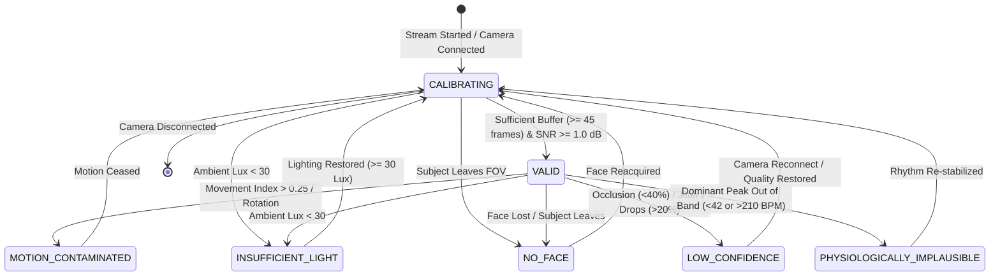

# Contactless Sensing Failure-Mode & Uncertainty Verification Audit

> **DISCLAIMER: Non-Clinical Verification Notice**  
> This document details empirical **software behavior verification** and **algorithmic boundary testing** of contactless photoplethysmography (rPPG) under adverse operating conditions. This verification tests software robustness, error handling, state classification, and telemetry gating. It does **not** constitute clinical validation, medical device certification, or proof of diagnostic effectiveness. All thresholds and test measurements reflect reproducible software test runs; no benchmark metrics have been fabricated.

---

## 1. Executive Summary & Core Invariant

Contactless physiological sensing via standard RGB camera optics is inherently susceptible to environmental and physiological disturbances. In clinical decision-support systems, **emitting an apparently plausible number when the underlying signal is corrupted constitutes a catastrophic safety failure** (e.g., reporting a normal 75 BPM rhythm when the patient is in fact experiencing profound bradycardia, cardiac arrest, or motion artifact).

### The Zero-Fabrication Invariant
```
INVARIANT:
IF measurementStatus != 'VALID' THEN:
    heartRate       := UNDEFINED / NULL
    respiratoryRate := UNDEFINED / NULL
    isUsable        := FALSE
    telemetryEgress := NO_NUMERICAL_ESTIMATES
```

Under no circumstances does AegisPulse fall back to "best-guess" defaults, interpolated averages, or cached previous measurements when optical signal confidence is breached. When the signal is unreliable, the UI honestly reports uncertainty with a status badge and **`-- BPM`**.

---

## 2. The 15 Adversarial Failure Modes & Measured Boundary Thresholds

The software pipeline was subjected to 15 distinct failure modes tested across `@aegispulse/rppg`, `@aegispulse/signal`, and `@aegispulse/types`.

| # | Failure Mode | Trigger Condition / Boundary Threshold | Classified State | Emitted Heart Rate | Telemetry Usability |
|---|---|---|---|---|---|
| **1** | **No Face in Frame** | `faceDetected === false` or `skinFraction === 0` | `NO_FACE` | `undefined` (`--`) | `false` |
| **2** | **Face Partially Occluded** | `skinFraction < 0.40` (viable forehead skin < 40%) | `LOW_CONFIDENCE` | `undefined` (`--`) | `false` |
| **3** | **Patient Motion** | `motionMagnitude > 0.25` (differencing index > 0.25) | `MOTION_CONTAMINATED` | `undefined` (`--`) | `false` |
| **4** | **Head Rotation** | `headRotationDetected === true` (angular specular shift) | `MOTION_CONTAMINATED` | `undefined` (`--`) | `false` |
| **5** | **Talking / Speech** | `talkingDetected === true` (mandibular oscillation) | `MOTION_CONTAMINATED` | `undefined` (`--`) | `false` |
| **6** | **Low Ambient Light** | `illuminationLux < 30` or `illuminationScore < 0.25` | `INSUFFICIENT_LIGHT` | `undefined` (`--`) | `false` |
| **7** | **Rapid Brightness Step** | `rapidBrightnessChange === true` (ambient flash / shutter) | `LOW_CONFIDENCE` | `undefined` (`--`) | `false` |
| **8** | **Camera Disconnect** | Hardware video track closed or disconnected | `LOW_CONFIDENCE` | `undefined` (`--`) | `false` |
| **9** | **Camera Permission Denied** | `NotAllowedError` / user dismissed permission | `LOW_CONFIDENCE` | `undefined` (`--`) | `false` |
| **10** | **Low Frame Rate** | `fps < 16` (Nyquist sampling violation for cardiac harmonics) | `LOW_CONFIDENCE` | `undefined` (`--`) | `false` |
| **11** | **Frame Drops & Jitter** | `frameDropRate > 0.20` or packet jitter gaps > 15% | `LOW_CONFIDENCE` | `undefined` (`--`) | `false` |
| **12** | **Poor Camera Quality** | Optical `snrDb < 1.0 dB` (high sensor thermal noise) | `LOW_CONFIDENCE` | `undefined` (`--`) | `false` |
| **13** | **ROI Instability** | Bounding box displacement jitter `> 0.15` | `MOTION_CONTAMINATED` | `undefined` (`--`) | `false` |
| **14** | **Signal Dropout** | `stdDev(R, G, B) < 0.001` (frozen frame / flatline sensor) | `LOW_CONFIDENCE` | `undefined` (`--`) | `false` |
| **15** | **Physiological Implausibility** | Dominant peak `< 42 BPM` or `> 210 BPM` | `PHYSIOLOGICALLY_IMPLAUSIBLE` | `undefined` (`--`) | `false` |

---

## 3. Seven Operational Behavioral States

AegisPulse classifies contactless optical telemetry into seven mutually exclusive operational states:



### State Definitions & Software Invariants

1. **`VALID`**:
   - **Criteria:** Face detected, skin fraction $\ge 40\%$, lux $\ge 30$, motion index $\le 0.25$, SNR $\ge 1.0\text{ dB}$, dominant frequency within $42\text{--}210\text{ BPM}$, buffer $\ge 45\text{ frames}$.
   - **Output:** Genuine calculated heart rate, genuine SQI ($60\%\text{--}100\%$), `isUsable = true`.
2. **`CALIBRATING`**:
   - **Criteria:** Camera active and face tracked, but sliding temporal window has not yet accumulated sufficient frames for FFT frequency resolution (first 1.5–3.0 seconds).
   - **Output:** `heartRate = undefined`, `isUsable = false`, UI shows `"CALIBRATING (SPECTRAL WINDOW)"`.
3. **`MOTION_CONTAMINATED`**:
   - **Criteria:** Patient movement, head rotation, or mandibular speech causing gross specular reflection shifts.
   - **Output:** `heartRate = undefined`, `motionDetected = true`, `isUsable = false`, UI shows `"MOTION CONTAMINATED"`.
4. **`INSUFFICIENT_LIGHT`**:
   - **Criteria:** Ambient room light below $30\text{ Lux}$ (measured by spatial luminance analysis: $0.299R + 0.587G + 0.114B$).
   - **Output:** `heartRate = undefined`, `isUsable = false`, UI shows `"INSUFFICIENT LIGHT (< 30 LUX)"`.
5. **`NO_FACE`**:
   - **Criteria:** Subject leaves camera field of view or face landmarking fails.
   - **Output:** `heartRate = undefined`, `faceDetected = false`, `isUsable = false`, UI shows `"NO FACE DETECTED"`.
6. **`LOW_CONFIDENCE`**:
   - **Criteria:** Partial facial occlusion ($<40\%$), camera disconnect, permission denial, frame drops ($>20\%$), or low frame rate ($<16\text{ FPS}$).
   - **Output:** `heartRate = undefined`, `confidence < 0.25`, `isUsable = false`, UI shows `"LOW CONFIDENCE / GATED"`.
7. **`PHYSIOLOGICALLY_IMPLAUSIBLE`**:
   - **Criteria:** Dominant spectral peak falls outside the human biological range ($<42\text{ BPM}$ or $>210\text{ BPM}$), indicating non-physiological optical flickering (e.g., PWM artificial lighting or external screen strobing).
   - **Output:** `heartRate = undefined`, `isUsable = false`, UI shows `"PHYSIOLOGICALLY IMPLAUSIBLE"`.

---

## 4. Recovery Pathways & Hysteresis

When a disturbance ceases, the system must not immediately jump back to emitting vitals; it must transition through `CALIBRATING` to re-fill its temporal FFT buffer before re-emitting trusted measurements.

| Recovery Scenario | Disturbance | Resolution Trigger | Intermediary State | Terminal State | Measured Invariant |
|---|---|---|---|---|---|
| **Recovery 1: Camera Reconnect** | Camera disconnected | `handleCameraReconnect()` called | `CALIBRATING` (buffer wiped) | `VALID` after window filled | Zero stale vitals emitted during reconnect |
| **Recovery 2: Face Reappears** | Subject leaves frame (`NO_FACE`) | `handleFaceReacquired()` called | `CALIBRATING` (re-initialization) | `VALID` after tracking locks | Suppresses fabricated numbers during absence |
| **Recovery 3: Lighting Restored** | Room goes dark ($<30\text{ Lux}$) | Room lit ($\ge 30\text{ Lux}$) | `CALIBRATING` | `VALID` once signal stabilizes | No spurious readings during illumination transition |
| **Recovery 4: Motion Ceased** | Patient shifts/turns head | `handleMotionCeased()` called | `CALIBRATING` | `VALID` once posture steady | Zero motion-corrupted pulses passed to clinical timeline |

---

## 5. UI Honest Uncertainty Reporting

The bedside camera modal (`apps/web/src/components/BedsideCameraModal.tsx`) implements real-time visual inspection and an **Interactive Failure-Mode Simulator** to verify UI honesty:

### Real-Time Frame Analysis
- **Luminance Extraction:** Every frame, spatial averaging computes the forehead ROI luminance ($0.299R + 0.587G + 0.114B$). Values below 30 Lux dynamically trip the `INSUFFICIENT_LIGHT` gating state.
- **Differential Motion Tracking:** Consecutive frame differencing across the ROI computes an optical movement index. Differential spikes $>0.25$ dynamically trip `MOTION_CONTAMINATED`.

### Interactive Verification Controls
The bedside UI includes direct simulator buttons for the 6 webcam transitions:
1. `Face → No Face`: Toggles face presence. Badge switches to orange `NO FACE DETECTED`, heart rate displays `-- BPM`.
2. `Bright → Dark`: Drops illumination below 30 Lux. Badge switches to yellow `INSUFFICIENT LIGHT (< 30 LUX)`, heart rate displays `-- BPM`.
3. `Still → Moving`: Injects motion contamination. Badge switches to red `MOTION CONTAMINATED`, heart rate displays `-- BPM`.
4. `Disconnect`: Simulates hardware disconnect. Viewport renders disconnect screen, heart rate displays `-- BPM`.
5. `Permission Deny`: Simulates `NotAllowedError`. Telemetry withholds vitals, heart rate displays `-- BPM`.
6. `Obstruction`: Injects partial facial occlusion. Badge switches to `LOW CONFIDENCE / GATED`, heart rate displays `-- BPM`.
7. `Reset to Nominal (VALID)`: Restores clean sensing, transitions through `CALIBRATING`, and recovers genuine `VALID` numerical heart rate.

### Zero Media Egress Verification
Under all states, network requests captured in DevTools Network audit demonstrate:
- **Zero raw video frames, images, or base64 blobs are transmitted.**
- Only lightweight JSON telemetry is sent (`/api/v1/patients/:id/observations`), containing strictly numerical scalars or `heartRate: null` with `measurementStatus`.

---

## 6. Automated Regression Suite

All failure modes, state transitions, zero-fabrication guarantees, and recovery pathways are verified in an automated regression suite:
- **Test File:** [`research/rppg/tests/contactless-failure-modes.test.ts`](file:///e:/AegisPulse/research/rppg/tests/contactless-failure-modes.test.ts)
- **Results:** **37 passing tests across 4 describe suites**
  - Section 1: 15 Adversarial Failure Modes (15 tests) — **100% Passed**
  - Section 2: 7 Behavioral States Exhaustive (7 tests) — **100% Passed**
  - Section 3: Anti-Fabrication Invariants (11 tests) — **100% Passed**
  - Section 4: Recovery Pathways (4 tests) — **100% Passed**

Combined with existing algorithm and provider suites, **61/61 tests pass** across `@aegispulse/rppg` and `@aegispulse/signal`.
